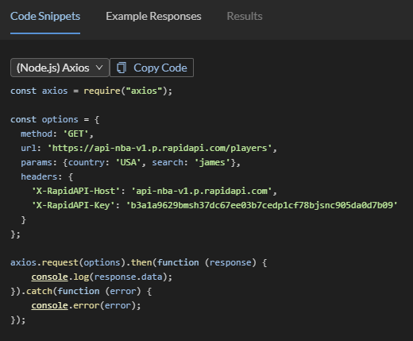

<h1>Panoramica del progetto</h1>

Il progetto consiste nello sviluppo di una dashboard (web application frontend + backend) che mostri all'utente varie informazioni relative alla NBA, come partite, classifiche e alcune statistiche. Tali informazioni saranno reperite tramite endpoint API pubblici.

Per la sua realizzazione vengono utilizzate diverse tecnologie, in particolare quelle principali sono [NodeJS](https://nodejs.org/) ed [ExpressJS](https://expressjs.com/) per implementare il server e [ReactJS](https://reactjs.org/) per il frontend. Per creare il backend è stato utilizzato [create-nodejs-express-app](https://www.npmjs.com/package/create-nodejs-express-app), mentre per il frontend è stato utilizzato [create-react-app](https://create-react-app.dev/).

Una panoramica della struttura del progetto la si può osservare anche consultando lo schema presentato nell'immagine "ApplicationArchitecture.png", reperibile nella directory principale del progetto.

<h1>Decisioni di design</h1>

<h2>Riguardo all'implementazione delle singole funzionalità</h2>

L'utilizzo di React implica che l'applicativo risulti in una web app _mono-pagina_, dove diverse componenti vengono renderizzate all'occorrenza per realizzare le diverse funzionalità offerte dall'applicativo.
Per implementare queste funzionalità si è deciso di considerare ognuna di queste come una componente ("_React components_"), prevedendo eventuali sottocomponenti richiamate al suo interno. Queste singole componenti _padre_ vengono poi importate e renderizzate all'occorrenza all'interno della componente principale dell'applicativo: _**App**_. 

<h2>Riguardo alla struttura del repository</h2>

Il repository si divide in tre cartelle principali:
- **_client_**: contiene la parte frontend dell'applicazione;
- **_server_**: contiene la parte backend dell'applicazione;
- **_docs_**: contiene la documentazione dell'applicazione.

All'interno della cartella _client_ vi è la cartella _src_ che contiene:
- **_components_**: contiene tutte le componenti React implementate;
- **_test_**: contiene tutti i file di test relativi alle componenti citate al punto precedente.

All'interno della cartella _server_ vi sono le cartelle:
- **_routes_**: contiene le API implementate;
- **_test_**: contiene tutti i file di test relativi alle API citate al punto precedente.

<h1>API</h1>

L'API da cui vengono reperite le informazioni utilizzate/mostrate è [API-NBA](https://rapidapi.com/api-sports/api/api-nba), consultabile presso l'hub di [RapidAPI](https://rapidapi.com/hub).

Degli snippet sono reperibili dalla pagina dell'API, dove si possono selezionare diversi linguaggi e librerie, ottenendo il codice necessario ad implementare la chiamata; in questo caso si è interessati al linguaggio JavaScript ed alla libreria [Axios](https://axios-http.com/):

Qui si possono vedere le informazioni necessarie ad effettuare una chiamata in maniera corretta, ovvero come impostare in maniera appropriata i campi _method_, _url_, _params_ e _headers_. Come si può notare, è necessario specificare all'interno del campo _headers_ una API-KEY valida, ottenibile registrandosi al sito e sottoscrivendo un abbonamento per l'utilizzo dell'API.

<h1>Procedure operative</h1>

Per la gestione dei package JavaScript viene utilizzato _npm_. 

Per l'installazione dei package necessari vengono eseguiti i seguenti comandi:

~~~
// Per il Client
cd client
npm install
// Per il Server
cd ../server
npm install
~~~

Per l'avvio dell'applicazione in fase di developement:

~~~
// Su un terminale per il Client
cd client
npm start
// Su un terminale per il Server
cd server
npm start
~~~

Per l'esecuzione dei test:

~~~
// Per testare il Client
cd client
npm test
// Per testare il Server
cd ../server
npm test
~~~

Si noti che ad ogni push sul repository vengono eseguiti sia i test lato client sia i test lato server grazie alla presenza del file _.gitlab-ci.yml_, che contiene una pipeline che automatizza l'esecuzione dei test dell'applicazione.

Per il build: 

~~~
cd client
npm run build
~~~

Il deploy è stato effettuato su [Heroku](https://www.heroku.com/). L'applicazione è disponibile al seguente link: [NBAScore](https://nbascore.herokuapp.com/#/live).

<h1>Documentazione per lo sviluppatore e per l'utente</h1>

Nella cartella _docs_ sono presenti il file relativo alla documentazione per lo sviluppatore e il file relativo alla documentazione per l'utente; entrambi questi file sono divisi in sezioni relative alle singole funzionalità (storie) implementate.
