<h1>Visualizzazione In Live</h1>

<h2>Caso Ideale</h2>

All'apertura della pagina/componente, l'utente vedrà una lista di molteplici partite secondo il seguente ordine:
- sono state disputate in giornata odierna (Finished);
- si stanno disputando (In Play);
- si dovranno disputare nell'arco della giornata odierna (Scheduled).

Di seguito un esempio:

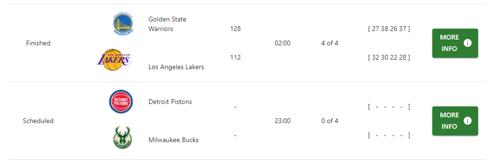

E' possibile scorrere verticalmente i risultati nella tabella.

Se l'utente sta utilizzando una versione mobile della piattaforma, per poter visualizzare tutti i dettagli, dovrà scorrere orizzontalmente la lista.

Se un utente volesse visualizzare in dettaglio le informazioni di una determinata partita allora può farlo premendo il pulsante con la scritta "More Info" situato a destra della riga di ogni partita.

Se l'utente clicca sul logo o sul nome di una determinata squadra, verrà aperta la pagina di visualizzazione informazioni più dettagliate di essa.

<h2>Caso di lista vuota</h2>

Se in un determinato giorno non vi sono partite allora l'utente vedrebbe comparire un avviso che lo informerebbe di tale casistica.

<h2>Caso di Errore Interno</h2>

Se una volta caricata la pagina web viene mostrato l'alert che avvisa della mancanza delle parite in quella giornata nonostante ci siano, significa che c'è un errore interno e il servizio di ricerca delle partite live non è disponibile; l'utente non può farci nulla.

<h1>Visualizzazione Classifiche</h1>

La pagina permetterà di ricercare le informazioni sulla classifica delle squadre in una particolare stagione e conference, entrambe selezionate dall'utente.

I risultati della ricerca saranno riportati in formato tabellare.

<h2>Caso d'uso "ottimale"</h2>

Una volta completato il caricamento di tale pagina web, l'utente potrà selezionare la stagione e la conference di suo interesse tramite gli appositi menu a tendina ed avviare la ricerca premendo il pulsante dedicato.

Le informazioni sulla classifica, ottenute come risultato della ricerca, verranno visualizzate nel seguente modo:

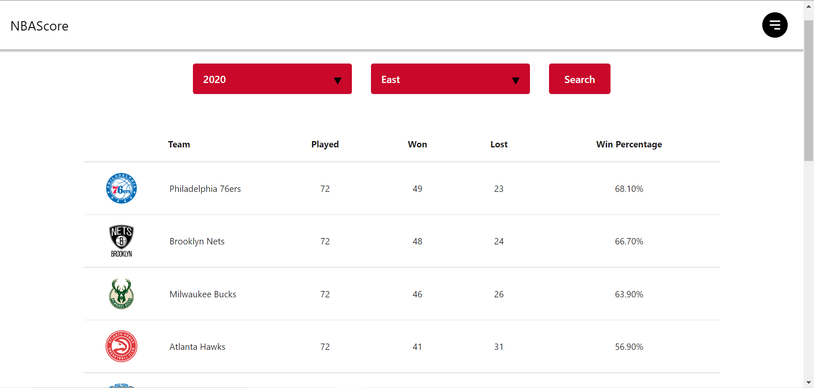

Inoltre, cliccando sul logo o sul nome di una delle squadre contenute nella tabella, sarà possibile visualizzare le informazioni relative a tale squadra.

Infine, una volta completata la ricerca è possibile effettuarne un'altra.

<h2>Caso di assenza di informazioni sulla classifica</h2>

Se una volta che si è effettuata la ricerca viene visualizzato il messaggio '_Standing not available for these parameters_', ciò significa che non è stata trovata alcuna informazione sulla classifica nella stagione e nella conference selezionate.

E' comunque possibile effettuare una nuova ricerca.

<h2>Caso di Errore dell'utente</h2>

Se si seleziona solo la stagione dal relativo menu a tendina e si tralascia la conference, o viceversa, o non si seleziona nessuno di questi due parametri e si avvia la ricerca, allora verrà visualizzato un messaggio di errore che avverte che non sono stati settati tutti i parametri di ricerca.

E' comunque possibile effettuare una nuova ricerca.

<h2>Caso di Errore Interno</h2>

Se una volta caricata la pagina web viene mostrato il messaggio '_Service temporarily unavailable. Unable to connect to the remote API._', ciò significa che c'è un errore interno e il servizio _Visualizzazione Classifiche_ attualmente non è disponibile; l'utente non può farci nulla.

<h1>Classifiche Per Squadra</h1>

La pagina permetterà di ricercare le informazioni riguardanti il posizionamento in classifica di una particolare squadra, selezionata dall'utente, nelle varie stagioni disponibili.

I risultati della ricerca saranno riportati in formato tabellare.

<h2>Caso d'uso "ottimale"</h2>

Una volta completato il caricamento di tale pagina web, l'utente potrà selezionare la squadra di suo interesse tramite l'apposito menu a tendina ed avviare la ricerca premendo il pulsante dedicato.

Le informazioni sul piazzamento in classifica di quella squadra nelle varie stagioni (ossia i risultati della ricerca), verranno visualizzate nel seguente modo:

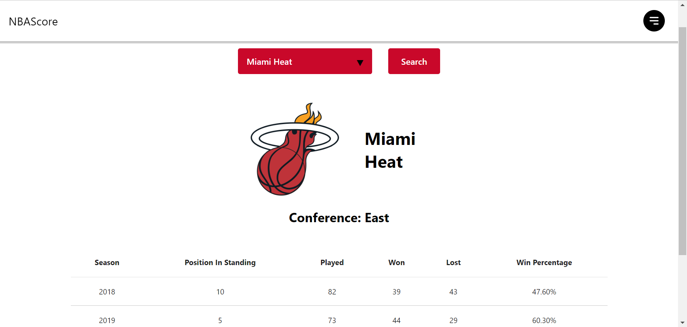

Inoltre, una volta completata la ricerca è possibile effettuarne un'altra.

Infine, cliccando sul logo o sul nome della squadra, riportato appena sopra la tabella coi risultati, sarà possibile visualizzare le informazioni relative a tale squadra.

<h2>Caso di assenza di informazioni sulle classifiche</h2>

Se una volta che si è effettuata la ricerca viene visualizzato il messaggio '_Standings not available for this Team_', ciò significa che non è stata trovata alcuna informazione sulle classificazioni della squadra selezionata.

E' comunque possibile effettuare una nuova ricerca.

<h2>Caso di Errore dell'utente</h2>

Se non si seleziona la squadra nel relativo menu a tendina e si avvia la ricerca, allora verrà visualizzato un messaggio di errore che avverte che non è stato settato il parametro di ricerca.

E' comunque possibile effettuare una nuova ricerca.

<h2>Caso di Errore Interno</h2>

Se una volta caricata la pagina web viene mostrato il messaggio '_Service temporarily unavailable. Unable to connect to the remote API._', ciò significa che c'è un errore interno e il servizio di _Classifiche Per Squadra_ attualmente non è disponibile.

Se, invece, la pagina si carica normalmente ma una volta che si è effettuata una ricerca, al posto dei risultati attesi viene visualizzato il testo '_Error:_ ' seguito da un _messaggio di errore_, ciò vuol dire che c'è stato un errore interno durante l'ottenimento dei risultati della ricerca.

In entrambi questi casi, l'utente non può fare nulla per risolvere la situazione.

<h1>Ricerca Partite Per Data</h1>

<h2>Struttura della pagina</h2>

Nella pagina è presente un calendario da cui l'utente seleziona la data di cui vuole vedere le partite. Si tratta di un calendario di facile utilizzo, dato che l'utente può navigare al suo interno per ricercare una determinata data; ad esempio, l'utente può selezionare l'anno di suo interesse, per poi scegliere il mese e il giorno che vuole. Al primo caricamento della pagina la data selezionata nel calendario è la data odierna.

Una volta selezionata la data dal calendario, l'utente deve cliccare sul bottone _Scegli Data_ per avviare la ricerca delle partite di quella data.

La ricerca può essere ripetuta quante volte si vuole selezionando una nuova data.

<h2>Caso Ideale</h2>

Nella data selezionata vi sono delle partite e queste vengono mostrate all'utente nel seguente modo:

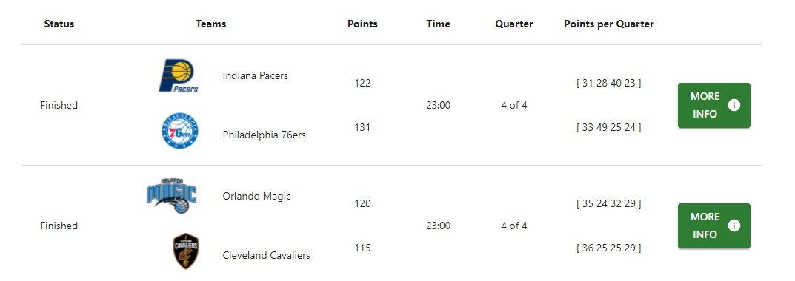

Si noti che cliccando sul logo o sul nome di una qualsiasi squadra della tabella verrà mostrata la pagina di visualizzazione informazioni dettagliate di quella squadra.

<h2>Caso di Data Senza Partite</h2>

Nella data selezionata non vi sono partite, quindi viene mostrato il messaggio informativo _Non vi sono partite per la data selezionata_ all'utente.

<h2>Caso di Errore Interno</h2>

Se l'API remota non è disponibile, viene mostrato il messaggio informativo _Servizio al momento non disponibile a causa dell'indisponibilità dell'API remota_ all'utente.

<h1>Partite per Squadra</h1>

Nella pagina saranno visibili due menu a tendina attraverso i quali è possibile selezionare una squadra e una stagione, oltre ad un bottone per avviare la ricerca. Una volta selezionate entrambe, squadra e stagione, e premuto il bottone, verrà visualizzata una tabella con tutte le partite relative a tale squadra e stagione. Inoltre cliccando su un apposito bottone presente accanto ad ogni partita, si verrà rimandati alla schermata descritta in "Visualizzazione Informazioni Partita", dove sarà possibile visualizzare informazioni più dettagliate a riguardo.

<h2>Caso d'uso "ottimale"</h2>

La pagina appare in questo modo prima della ricerca:

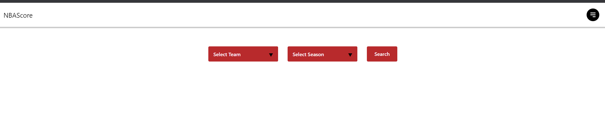

Una volta premuto il pulsante di ricerca, i dati vengono mostrati nel seguente modo:

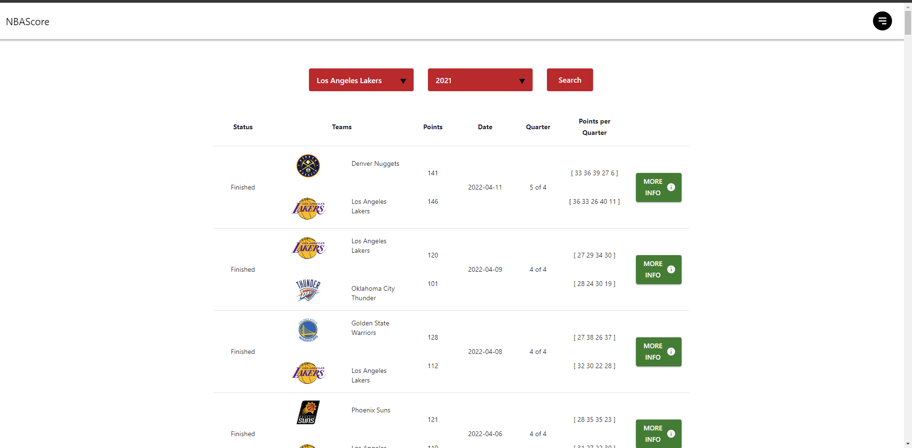

Si noti che cliccando sul logo o sul nome di una qualsiasi squadra della tabella verrà mostrata la pagina di visualizzazione informazioni dettagliate di quella squadra.

<h2>Caso d'uso "informazione mancante"</h2>

Nel caso in cui l'utente provi ad avviare la ricerca prima di aver selezionato squadra e stagione, verrà visualizzato un messaggio informativo e non comparirà alcuna tabella.

<h1>Ricerca Giocatore per Nome</h1>

Nella pagina saranno visibili due caselle di testo in cui poter inserire il nome e/o il cognome che si vuole ricercare. Sotto ad esse vi è un pulsante per far partire la ricerca dei giocatori che corrispondono ai valori nelle caselle.   Infine, se la ricerca ha riscontro positivo allora comparirà una lista al di sotto del pulsante di ricerca, dove ogni riga rappresenta un giocatore diverso.   Per ogni giocatore vi sono riportate le seguenti informazioni: il nome, il cognome, il logo della squadra (il nome della squadra se non è presente il logo) e la data di nascita.

<h2>Caso d'uso "ottimale"</h2>

In caso non ci siano problemi nel reperimento dei dati e la ricerca riporta almeno un giocatore, questi appaiono nel seguente modo:

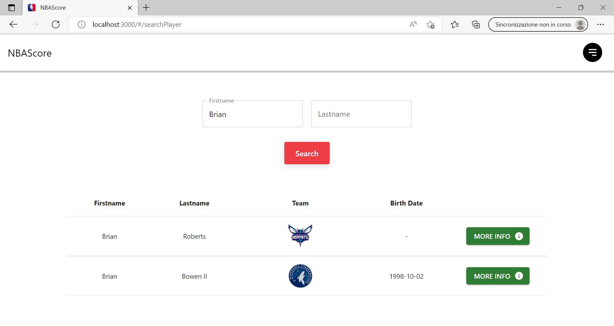

Inoltre, cliccando sul "More Info", sarà possibile visualizzare le informazioni relative a tale giocatore.

Infine, cliccando sul logo di una qualsiasi squadra della tabella verrà mostrata la pagina di visualizzazione informazioni dettagliate di quella squadra.

<h2>Casi d'uso "non ottimale"</h2>

Nel caso non vi siano informazioni da visualizzare, ad esempio nel caso ci siano stati errori nel reperire tali informazioni, verrà mostrato un messaggio informativo. Vi è anche una visualizzazione informativa di errore, nel caso in cui il servizio delle api non è raggiungibile. 

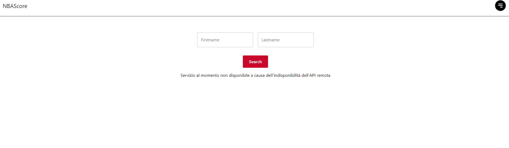

Infine, se non vi sono corrispondenze verrà visualizzato un messaggio informativo.

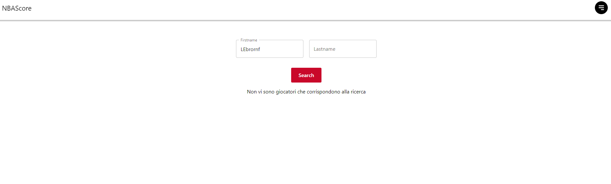

<h1>Ricerca Squadra per Nome</h1>

Nella pagina sarà una casella di testo in cui poter inserire il nome che si vuole ricercare. Ad ogni cambiamento del test verrà effettuata la ricerca delle squadre che corrispondono ai valori nelle caselle.   Infine, se la ricerca ha riscontro positivo allora comparirà una lista al di sotto, dove ogni riga rappresenta una squadra diversa.   Per ogni squadra vi sono riportate le seguenti informazioni: il nome, il nickname, il logo della squadra (il nome della squadra se non è presente il logo),il code e la city. Se la ricerca delle squadre produce un unico risultato allora comparirà direttamente la scheda con le informazioni più dettagliate di essa.

<h2>Caso d'uso "ottimale"</h2>

In caso non ci siano problemi nel reperimento dei dati e la ricerca riporta almeno una squadra, questi appaiono nel seguente modo:

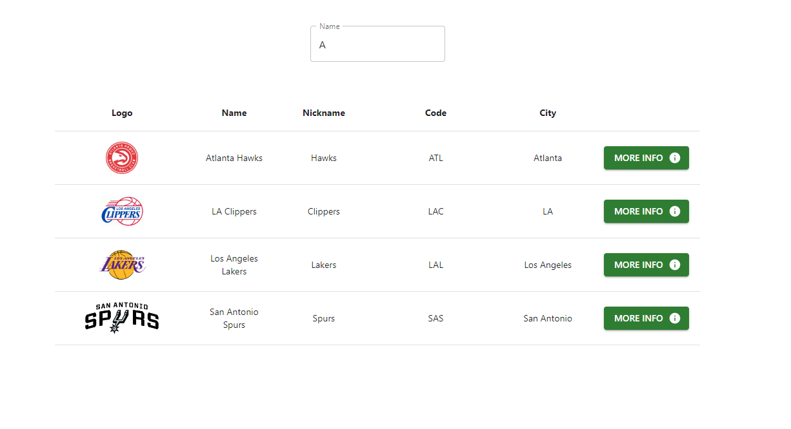

Inoltre, cliccando sul bottone "More Info" o la ricerca genera un unico risultato, sarà possibile visualizzare le informazioni relative a tale squadra.

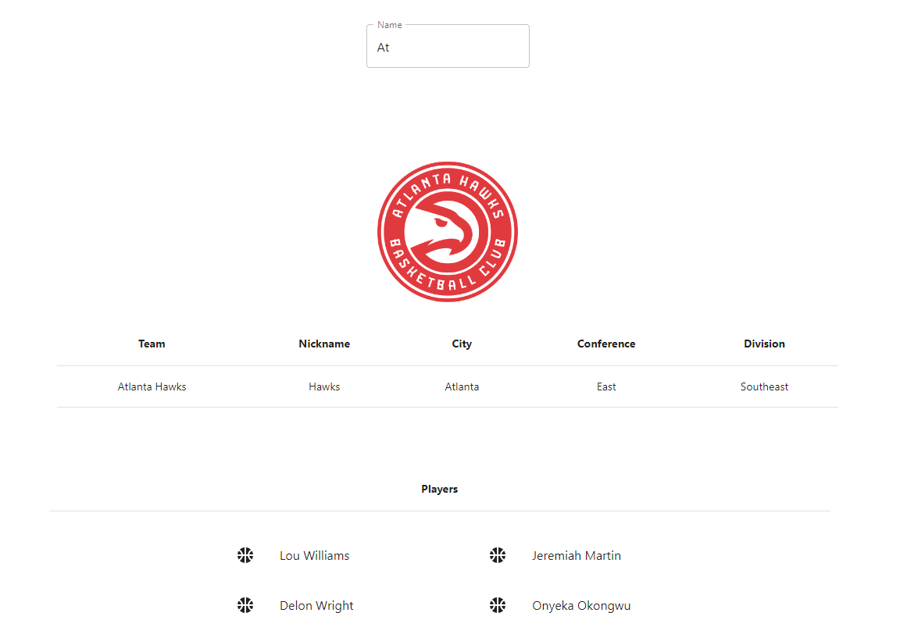

<h2>Casi d'uso "non ottimale"</h2>

Nel caso non vi siano informazioni da visualizzare, ad esempio nel caso ci siano stati errori nel reperire i dati, verrà mostrato un messaggio informativo. Vi è anche una visualizzazione informativa di errore, nel caso in cui il servizio delle api non è raggiungibile. 

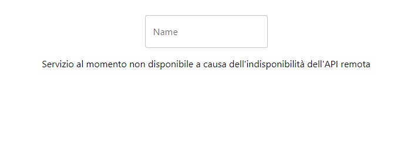

Infine, se non vi sono corrispondenze verrà visualizzato un messaggio informativo.

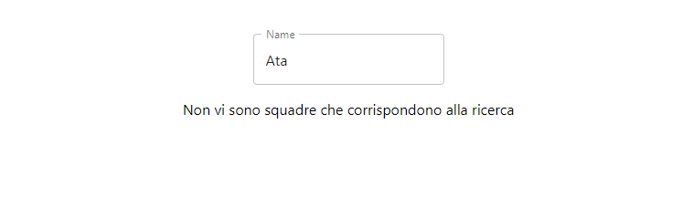

<h1>Formazione Vincente</h1>

<h2>Struttura della pagina</h2>

Nella pagina sono presenti:
- Menù a tendina contenente le squadre NBA, da cui l'utente seleziona la squadra di proprio interesse;
- Menù a tendina contenente le stagioni, da cui l'utente seleziona la stagione di proprio interesse;
- Bottone _Ricerca_, che l'utente clicca per avviare la ricerca della formazione vincente per la squadra selezionata nella stagione selezionata.

Al primo caricamento della pagina i menù a tendina contengono rispettivamente le voci _Seleziona Squadra_ e _Seleziona Stagione_, che non sono selezionabili. Se l'utente non seleziona la squadra e/o la stagione e clicca sul bottone per avviare la ricerca, viene mostrato un alert per informarlo che non ha inserito l'input necessario per effettuare la ricerca.

La ricerca può essere ripetuta quante volte si vuole selezionando una nuova squadra e/o una nuova stagione.

<h2>Caso Ideale</h2>

Per la squadra e la stagione selezionate è possibile il calcolo della formazione vincente e questa viene mostrata all'utente nel seguente modo:

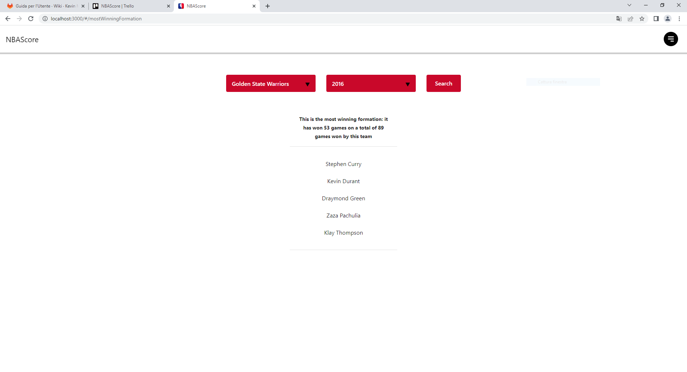

Si noti che cliccando su un qualsiasi giocatore della lista verrà mostrata la pagina di visualizzazione informazioni dettagliate di quel giocatore.

<h2>Caso di API remota contenente dati errati</h2>

L'API remota contiene dati errati che fanno in modo che non sia possibile calcolare in maniera corretta la formazione vincente, quindi viene mostrato il messaggio informativo _Risultati non disponibili per questi parametri, perché l'API remota contiene dati errati_.

<h2>Caso di Errore Interno</h2>

Se l'API remota non è disponibile, viene mostrato il messaggio informativo _Servizio al momento non disponibile a causa dell'indisponibilità dell'API remota_ all'utente.

<h1>Visualizzazione Informazioni Partita</h1>

Nella pagina sarà visibile una tabella con informazioni generali riguardanti la partita selezionata, assieme a 4 bottoni che permettono di visionare altre tabelle riguardanti statistiche più approfondite, riguardo alle due squadre e ai propri giocatori, più un bottone per rimuovere l'eventuale tabella precedentemente selezionata. 

In particolare, la tabella con le informazioni generali sarà sempre presente a schermo durante la visualizzazione, mentre per le altre i casi sono:
- Nessuna tabella visualizzata: questo accade al primo caricamento della pagina quando nessuno dei bottoni è stato premuto, o allo stesso modo dopo la pressione del bottone "_cancel_";
- Viene visualizzata la tabella relativa al bottone appena premuto: questo avviene premendo uno dei bottoni "_statistics_", "_home_", "_visitors_"; nel caso una delle tre fosse già mostrata, verrà sostituita da quella selezionata.

Inoltre, nella tabella delle informazioni generali è possibile cliccare sul logo o sul nome di una delle due squadre per visualizzare informazioni più dettagliate, e la stessa cosa vale per i nomi dei giocatori nella lista delle statistiche per giocatore.

<h2>Caso d'uso "ottimale"</h2>

In caso non ci siano problemi nel reperimento dei dati, questi appaiono nel seguente modo per le statistiche della partita:

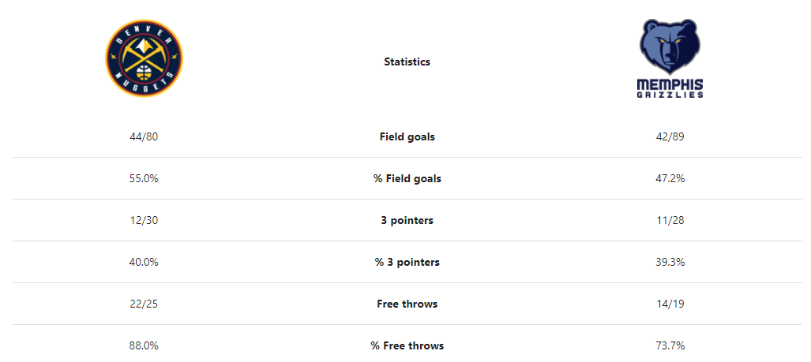

E nel seguente modo per le statistiche dei giocatori:

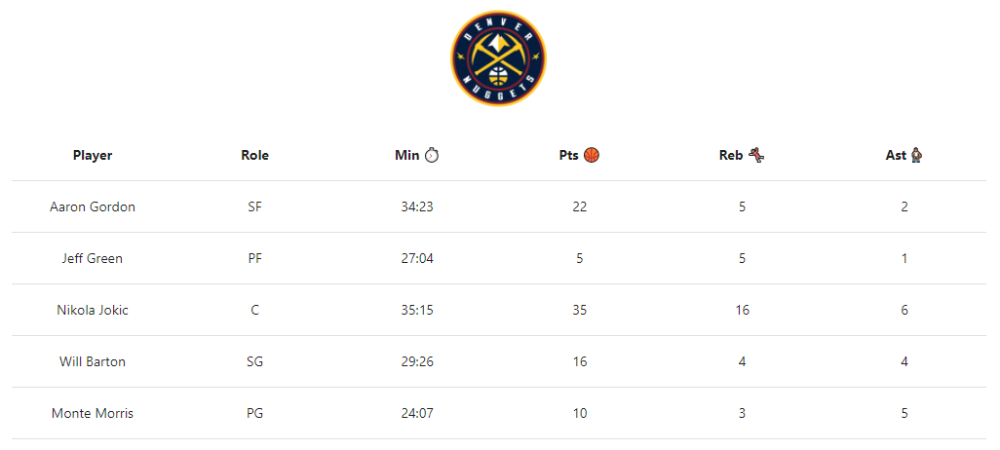

<h2>Caso d'uso "statistiche non disponibili"</h2>

Nel caso non vi siano informazioni da visualizzare, ad esempio nel caso che la partita selezionata non sia ancora iniziata, o ci siano stati errori nel reperire tali informazioni, verranno mostrati dei messaggi informativi.

<h1>Visualizzazione Informazioni Giocatore</h1>

Nella pagina sarà visibile una tabella con informazioni riguardanti il giocatore selezionato.

<h2>Caso d'uso "ottimale"</h2>

In caso non ci siano problemi nel reperimento dei dati, questi appaiono nel seguente modo:

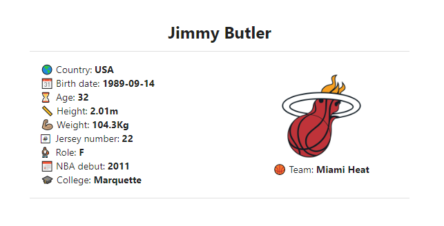

Inoltre, cliccando sul nome o sul logo della squadra, sarà possibile visualizzare le informazioni relative a tale squadra.

<h2>Caso d'uso "statistiche non disponibili"</h2>

Nel caso non vi siano informazioni da visualizzare, ad esempio nel caso ci siano stati errori nel reperire tali informazioni, verrà mostrato un messaggio informativo.

<h1>Visualizzazione Informazioni Squadra</h1>

Nella pagina sarà visibile una tabella con informazioni riguardanti la squadra selezionata, con il relativo elenco di giocatori nell'ultima stagione disponibile.

<h2>Come raggiungere la pagina web</h2>

Cliccando sul nominativo di una delle squadre presenti in qualunque altra pagina web dell'applicativo, verrà poi visualizzata la pagina delle informazioni relative a tale squadra.

Una volta visualizzata tale pagina però, qualunque sia il risultato che viene presentato, non è possibile ritornare alla pagina precedente se non tramite il menu di navigazione.

<h2>Caso d'uso "ottimale"</h2>

Una volta completato il caricamento di tale pagina web, le informazioni della squadra di interesse verranno visualizzate nel seguente modo:

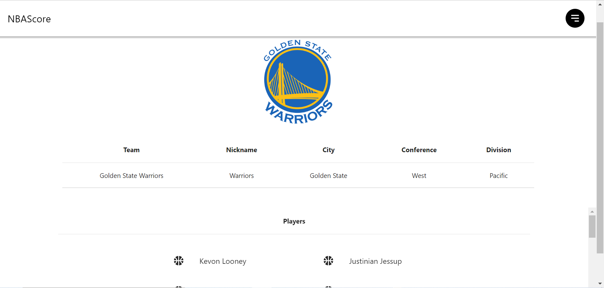

Inoltre, cliccando sul nome di uno dei giocatori nell'elenco, sarà possibile visualizzare le informazioni relative a tale giocatore.

<h2>Caso di Informazioni Non Disponibili</h2>

Se in alcune sezioni relative alle informazioni della squadra viene visualizzato il messaggio ‘_NA_’ (_Not Available_), ciò significa che quella particolare informazione attualmente non è disponibile.

<h2>Caso di Errore Interno</h2>

Se una volta caricata la pagina web viene mostrato il messaggio '_Service temporarily unavailable. Unable to connect to the remote API._', ciò significa che c'è un errore interno e il servizio di _Visualizzazione Informazioni Squadra_ attualmente non è disponibile; l'utente non può farci nulla.
